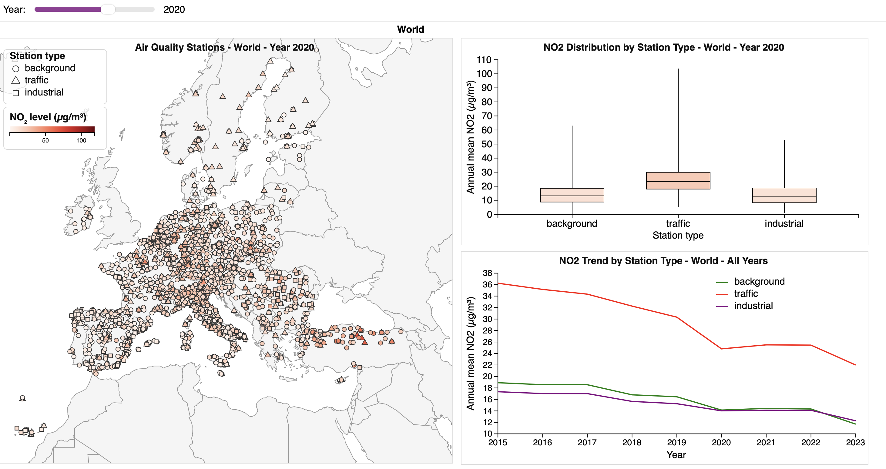
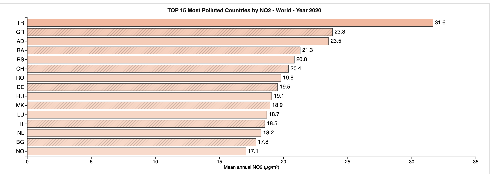
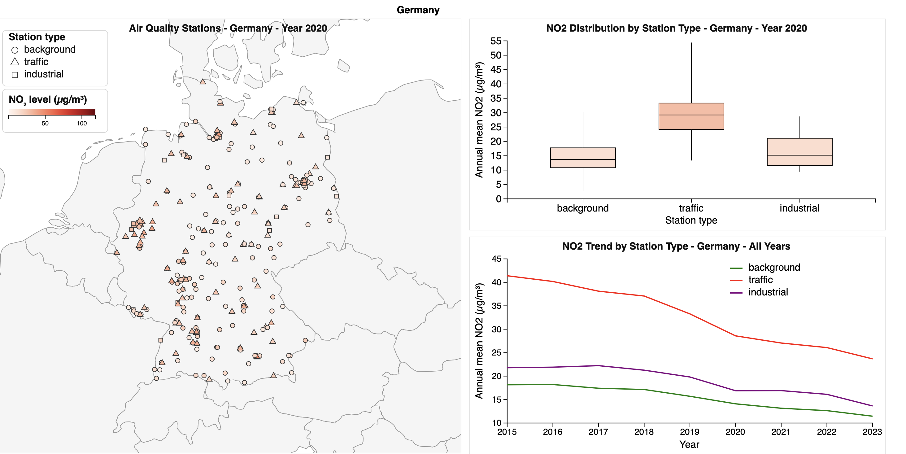

# Interactive Exploration of Annual Mean NO₂ in Europe

An interactive, coordinated-view visualization of annual mean nitrogen dioxide (NO₂) concentrations measured at air-quality monitoring stations across Europe. Built with [D3.js](https://d3js.org/) as a project for a data visualization course. The accompanying report is in `report.pdf`.

## Dataset

**Source:** EEA *Air Quality In-Situ Measurement Station Data*, published on Zenodo (European Environment Agency, 2024, record [14513586](https://doi.org/10.5281/zenodo.14513586)).

The original file is a Parquet table with annual values for NO₂, O₃, SO₂, PM10 and PM2.5 per station, 2015-2023 (not included in the repo). Only NO₂ is used here, because it is consistently available.

`parq2csv.py` reduces it to `air_quality_annual_viz.csv` (one row per station and year; rows with missing coordinates or NO₂ are dropped):

| Column           | Description                                   |
| ---------------- | --------------------------------------------- |
| `station_id`   | EEA station code                              |
| `country`      | Country code (e.g. DE, IT, FR)                |
| `lon`, `lat` | Station coordinates                           |
| `station_type` | `background`, `traffic` or `industrial` |
| `station_area` | Area type of the station (e.g. urban, rural)  |
| `year`         | 2015-2023                                     |
| `NO2`          | Annual mean NO₂ concentration (µg/m³)      |

## What is visualized

A global year slider (2015-2023) drives the year-specific views. There are two scopes: Europe and Germany.

- **Station maps** - stations at their coordinates, colored by NO₂ level (light-to-dark red) and shaped by station type (circle = background, triangle = traffic, square = industrial). Pan, zoom and hover tooltips are supported.
- **Boxplots** - NO₂ distribution per station type for the selected year.
- **Trend lines** - mean annual NO₂ per station type over all years.
- **Top countries** - bar chart of the 15 countries with the highest mean NO₂ in the selected year (Europe view only).

## Screenshots

**Europe overview (year 2020):** station map, boxplots and trend lines by station type, controlled by the year slider.



**Top 15 countries by mean annual NO₂ (year 2020):**



**Germany view (year 2020):** the same views focused on Germany.



## Running it

The page loads the CSV via `fetch`, so serve the folder over HTTP instead of opening `index.html` directly:

```sh
python3 -m http.server
# then open http://localhost:8000
```

`main.js` reads `data/air_quality_annual_viz.csv`. To regenerate it, run `parq2csv.py` from the folder that contains the Parquet file (requires `pandas` and `pyarrow`). The world basemap and D3 are loaded from CDNs, so an internet connection is needed.

## Files

- `index.html`, `main.js` - the visualization
- `parq2csv.py` - Parquet -> CSV preprocessing
- `data/` - dataset (Parquet and CSV)
- `main.tex` - project report

